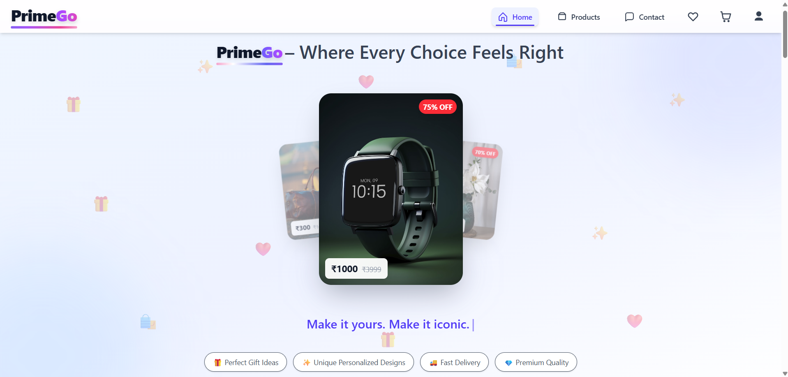

# PrimeGo — E-Commerce Platform

## 📝 About

**PrimeGo** is a **MERN stack**-based e-commerce platform designed to provide a seamless, secure, and personalized online shopping experience. It allows users to browse products, manage carts, place orders, make secure payments, and track deliveries.

Our mission is to make online shopping **accessible, affordable, and tailored just for you**, because every product is PrimeGo.

Founded in **2025**, PrimeGo delivers modern shopping experiences built for today's customers.

---

## 🌐 Live Demo

Try **PrimeGo** live:

👉 **[Open Live Project](https://prime-go.netlify.app/)**

---

## 🖼️ Project Overview

Here is a screenshot of the project:



---

## 🚀 Features

* **Product Management**: Browse, search, filter, and explore products with detailed information.
* **Shopping Cart**: Add, update, and remove products from the cart.
* **Secure Authentication**: JWT-based authentication with Google OAuth.
* **Online Payments**: Secure payments powered by Razorpay.
* **Order Management**: Place orders and view complete order history.
* **Shipping & Tracking**: Shiprocket integration for shipment and delivery tracking.
* **Cloud Image Storage**: Product images managed using Cloudinary.
* **Responsive Design**: Optimized for desktop, tablet, and mobile devices.

---

## 🛠️ Technologies Used

* **Frontend**: React.js, Vite, Redux, Bootstrap, Axios
* **Backend**: Node.js, Express.js, REST API
* **Database**: MongoDB, Mongoose
* **Authentication**: JWT, Bcrypt, Google OAuth
* **Payments**: Razorpay
* **Shipping**: Shiprocket
* **Cloud Storage**: Cloudinary
* **Deployment**: Netlify, Render, MongoDB Atlas
* **Tools**: Git, GitHub, Postman

---

## 💻 Installation

### Clone the repository

```bash
git clone https://github.com/yourusername/PrimeGo.git
```

### Install dependencies

```bash
cd frontend
npm install
```

```bash
cd backend
npm install
```

### Run the project

```bash
npm run dev
```

> Configure the required environment variables before running the application.
